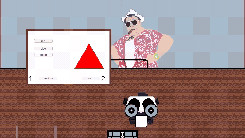

# Unity 2D book
## Description 
This is a gameObject based 2D two page book system using button navigation. The button navigation utilizes a table of contents and a next/previous page layout. The book also has a storage container and each page has a page number. (Note: these are placeholder assets)
## Demonstration
### Basic Book Navigation

### code
book navigation handler [code](Assets/scripts/pageHandler.cs)
###

